

  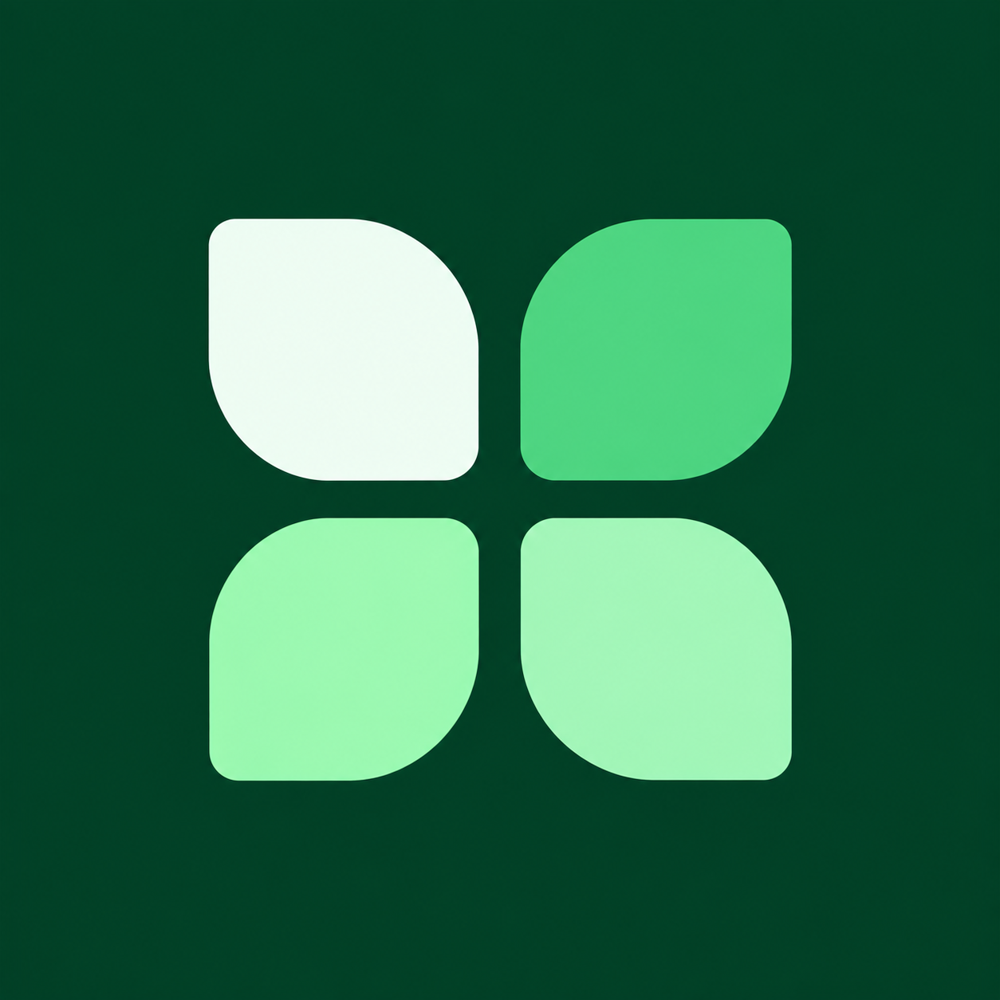
  <h1>MiniDrive</h1>
  <h3>Ваши файлы — рядом.</h3>
  
Фото, документы и заметки в чатах по темам. Один Google Диск. Все ваши устройства.

  
<strong>Windows</strong> &nbsp; · &nbsp; <strong>Android</strong> &nbsp; · &nbsp; <strong>Ваш Google Drive</strong>

  
<a href="#windows">Версия для ПК</a> &nbsp; / &nbsp; <a href="#android">Android</a> &nbsp; / &nbsp; <a href="#first-launch">Первый запуск</a>

  
<a href="https://dev-master-android.github.io/minidrive-pages/">О проекте</a> &nbsp; · &nbsp; <a href="https://dev-master-android.github.io/minidrive-pages/privacy.html">Конфиденциальность</a>

---

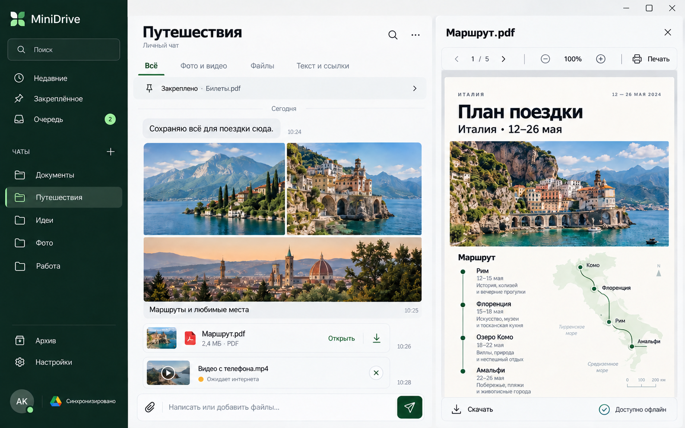

Чат, файлы и просмотр документа — в одном пространстве.

## Всё по своим местам

- **Каждой теме — свой чат.** В Google Диске ему соответствует отдельная папка внутри MiniDrive.
- **Добавляйте сейчас, отправляйте позже.** Очередь сохраняет файлы без сети и продолжает отправку при подключении.
- **Открывайте внутри приложения.** Просмотр фото, видео и PDF, кеш и доступ офлайн для выбранных файлов.
- **Возвращайтесь к важному.** Недавние записи, закрепления, поиск, подписи и альбомы.
- **Используйте свои устройства.** Поделиться на Android, сохранить копию по нажатию и печатать документы на ПК.

## Windows · Пространство для работы

Большой экран, спокойная навигация и просмотр файлов рядом с историей чата.

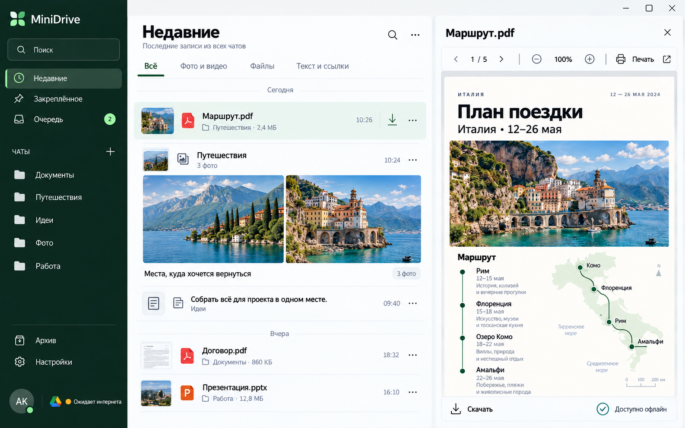

<strong>Недавние</strong> — последние записи из всех чатов.

<strong>Посмотреть остальные экраны Windows</strong>

### Закреплённое
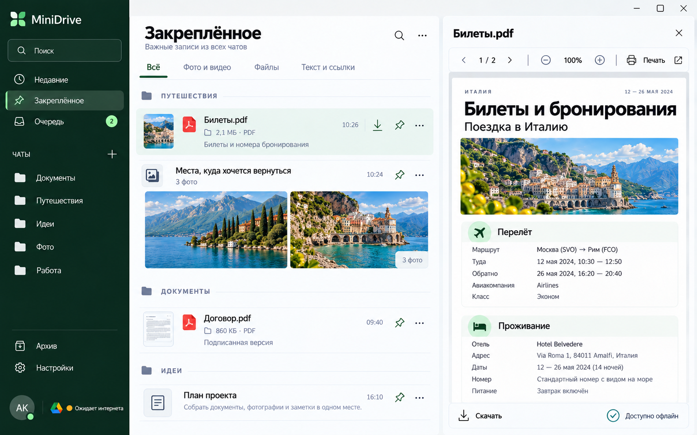

### Очередь
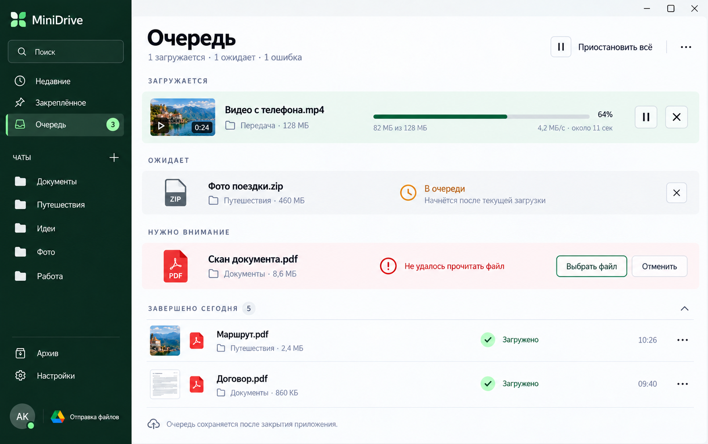

### Архив
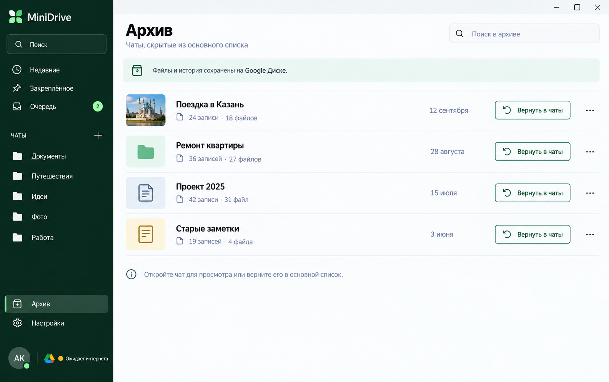

### Настройки
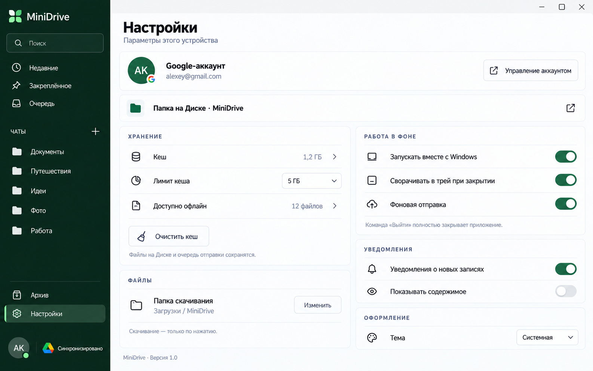

## Android · Всегда под рукой

Чаты по темам, быстрый доступ к недавнему и понятная очередь отправки.

<table>
  <tr>
    <td align="center" width="25%"><strong>Чаты</strong></td>
    <td align="center" width="25%"><strong>Недавние</strong></td>
    <td align="center" width="25%"><strong>Очередь</strong></td>
    <td align="center" width="25%"><strong>Настройки</strong></td>
  </tr>
  <tr>
    <td>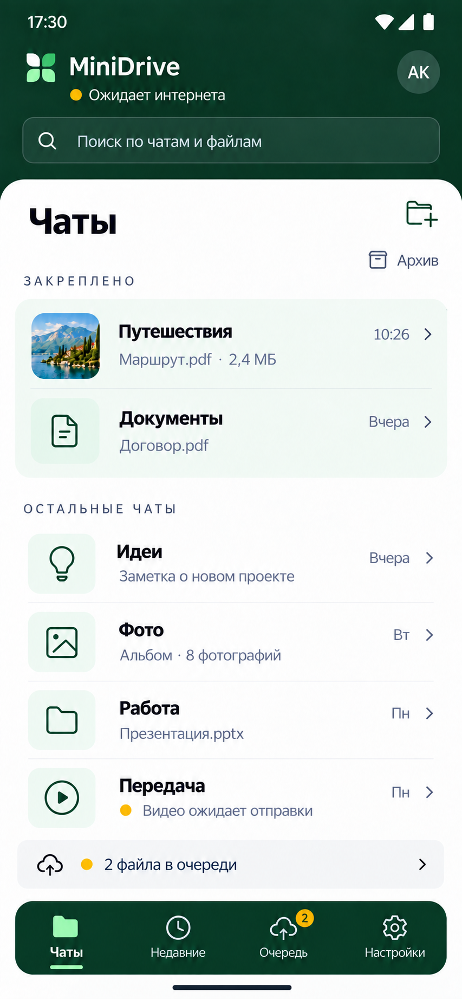</td>
    <td>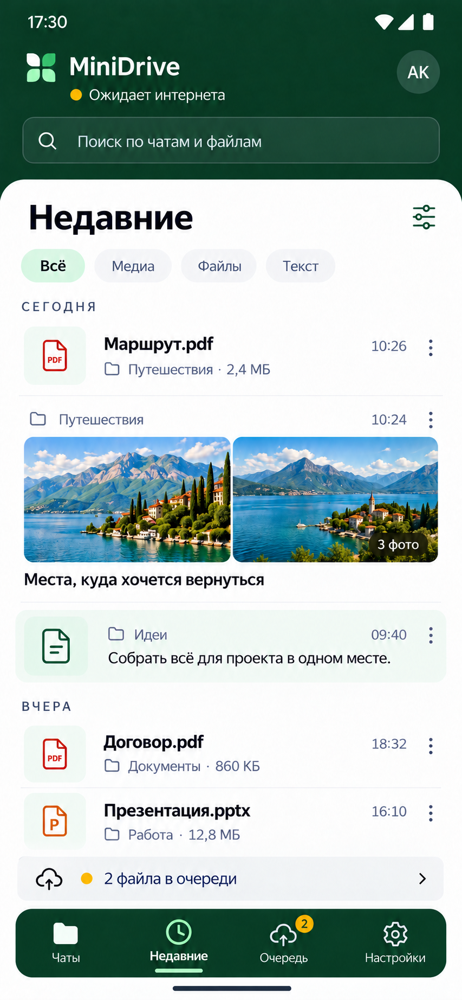</td>
    <td>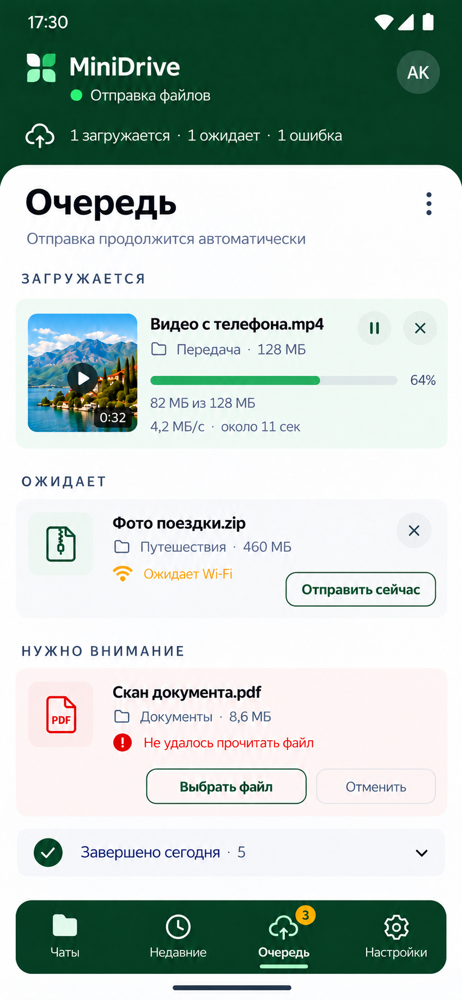</td>
    <td>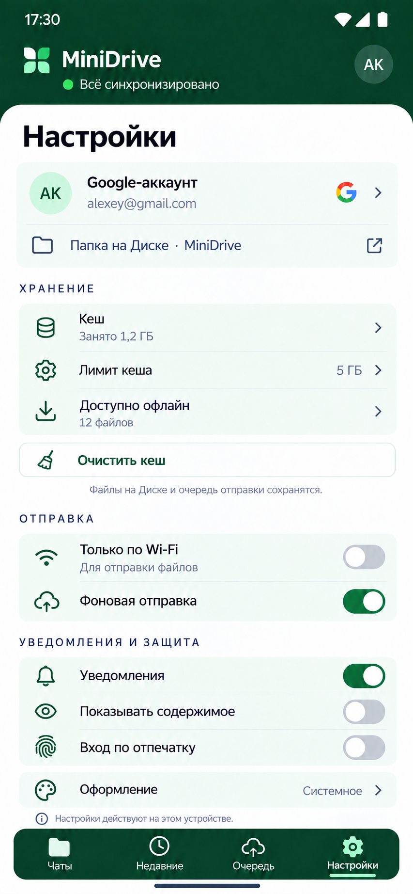</td>
  </tr>
</table>

## Первый запуск · Три шага знакомства

Ваши устройства → ваши темы → просмотр и офлайн. Затем вход через Google.

<table>
  <tr>
    <td align="center" width="25%"><strong>01 · Рядом</strong></td>
    <td align="center" width="25%"><strong>02 · По темам</strong></td>
    <td align="center" width="25%"><strong>03 · Офлайн</strong></td>
    <td align="center" width="25%"><strong>Вход</strong></td>
  </tr>
  <tr>
    <td>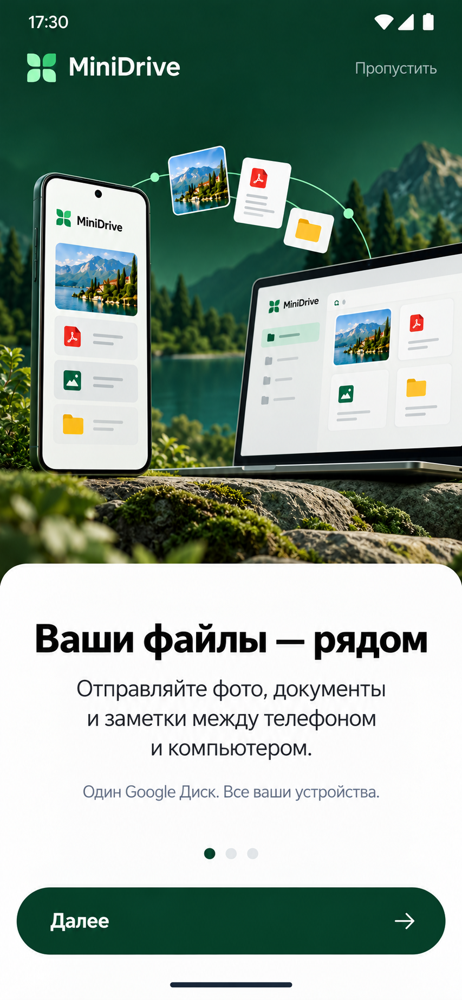</td>
    <td>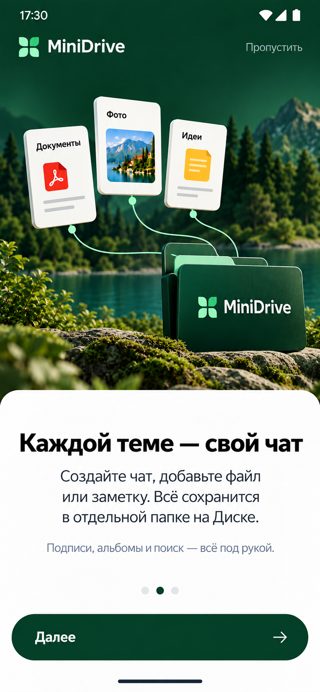</td>
    <td>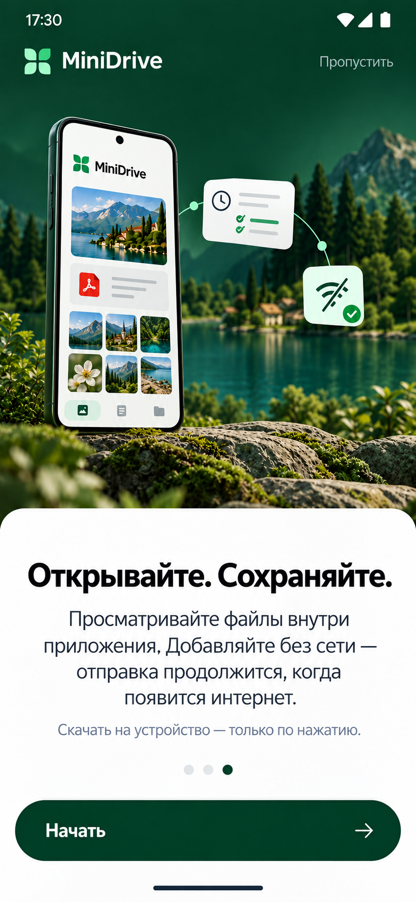</td>
    <td>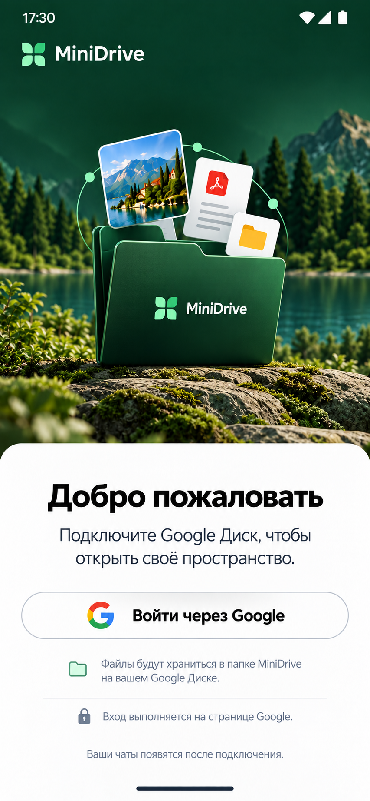</td>
  </tr>
</table>

---

### О галерее

Здесь представлены утверждённые **дизайн-макеты MiniDrive**. Они показывают стиль и расположение экранов; интерфейс сборок может отличаться в деталях. Проект находится в разработке.

Этот репозиторий содержит публичные изображения, описание приложения и страницы конфиденциальности. Хранилище файлов пользователя — его собственный Google Диск.

  
<strong>MiniDrive</strong> Личное пространство для ваших файлов.

  
<a href="https://dev-master-android.github.io/minidrive-pages/privacy.html">Privacy Policy</a> &nbsp; · &nbsp; <a href="https://dev-master-android.github.io/minidrive-pages/terms.html">Terms of Use</a>

